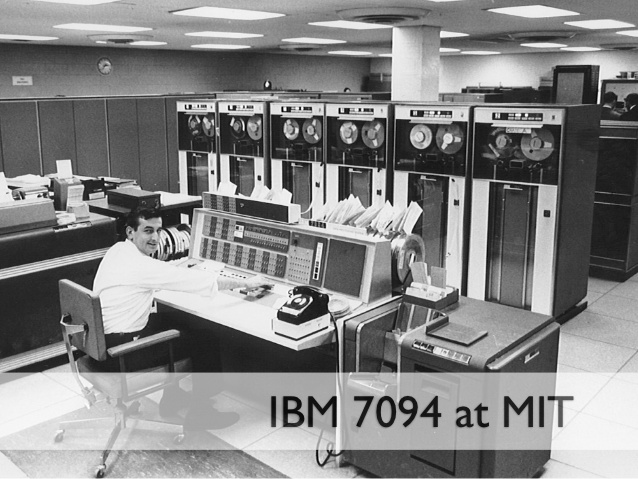
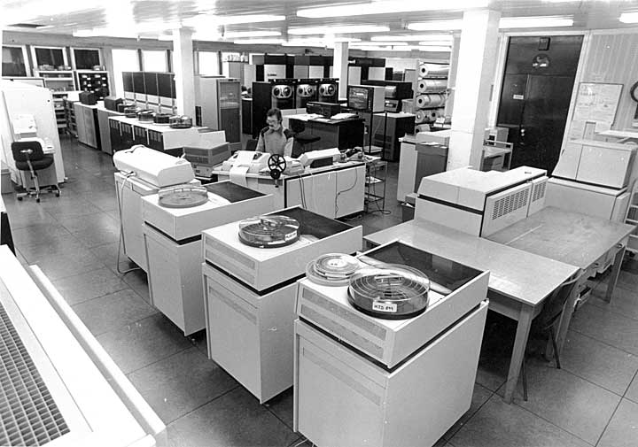
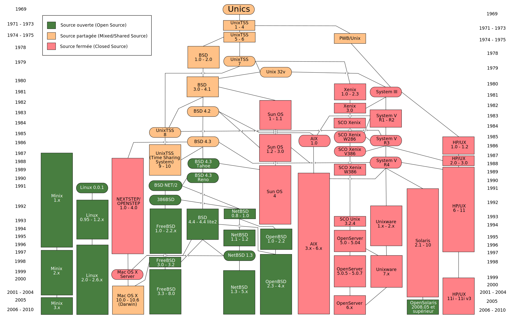

== Comment est né UNIX ?

=== Les premiers pas

Pour comprendre comment et pourquoi UNIX est né, il faut d’abord essayer de se remettre dans le contexte et comprendre où en était l’informatique dans les années 1950 et 1960.
Il s’agissait d’énormes machines prenant la place d’une très grande pièce et pesant plusieurs tonnes.
Bien entendu leur taille diminuait d’années en années, mais cela restait des machines très coûteuses, uniquement accessibles aux états, aux universités, aux plus grandes entreprises, et qui demandait des réparations et un entretient quotidien.
Ces machines-là ressemblaient fort aux machines industrielles: constituées d’un grand nombre de parties mécaniques.
Elles étaient lentes par rapport à aujourd’hui.
Pour économiser le temps machine, au lieu d’encoder directement les programmes informatiques sur un clavier relié à l’ordinateur, les informaticiens encodaient les programmes sur des cartes perforées de 80 colonnes, 8 bits par colonne.

//https://upload.wikimedia.org/wikipedia/commons/4/4c/Blue-punch-card-front-horiz.png
.Une carte perforée 80 colonnes d'IBM d'un des types les plus utilisés au xxe siècle.
image::images/punch-card.png[IBM Punch Card, 300, 300, align="left", link="images/punch-card.png"]

Une carte ou un ensemble de cartes perforées, selon la complexité, représentaient un programme, qui était chargé en mémoire, exécuté, pour finalement fournir le résultat via une imprimante, un écran ou une autre carte perforée pour une utilisation future.
La chose importante à retenir est que ces ordinateurs ne pouvaient exécuter qu’un seul programme à la fois.
Pour optimiser le rendement, les ingénieurs préparaient des batchs
footnote:[batch qui signifie en anglais: lot, paquet.]
, c’est à dire une compilation d’un ensemble de carte perforées (plusieurs programmes) sur une bande de plus grande longueur.
De cette manière, l’ordinateur pouvait charger et exécuter programme après programme rapidement, sans intervention humaine pour insérer chaque nouvelle carte perforée.
Il faut également savoir que s’il y avait la moindre erreur dans un programme, son exécution était stoppée.
Il fallait donc corriger, puis réintégrer la nouvelle version dans le prochain batch.
En 1957, un ingénieur d’IBM, Robert William Bemer
footnote:[Robert William Bemer a été un ingénieur de son temps fort actif: outre le concept du time-sharing, il a créé le code ASCII, il a participé à l’élaboration du langage COBOL, il a été le premier en 1971 à anticiper le bug de l’an 2000.]
, publie pour la première fois le concept du temps-partagé: plutôt que d’exécuter un seul programme à la fois, il propose qu'un grand nombre de terminaux pourraient être connectés au même moment au serveur central (au main frame), et que chaque utilisateur puisse avoir la possibilité d'interagir directement et d’entrer son code au clavier.
Il a pris pour hypothèse que le grand nombre d’utilisateurs simultané aurait pour effet de diminuer les périodes idle (au repos) du processeur central, tout en procurant aux utilisateurs plus de flexibilité car ils ne doivent pas attendre que leur programme soit intégré dans un batch.
Il peuvent l’écrire et l’exécuter en temps réel.
D’un point de vue technique, la difficulté réside dans la création d’un système d’exploitation capable de gérer l’exécution d’un grand nombre de programmes simultanément au moyen d’un seul processeur.
Il faut pouvoir interrompre et reprendre l’exécution pendant une courte durée des différents processus afin de les traiter en alternance et de donner l’impression aux utilisateurs que leur programme est exécuté en temps réel.
Cela implique notamment de sauvegarder l’état de chaque programme en mémoire, composant qui était très coûteux à l’époque.

===  CTSS

L’un des premier système d’exploitation ayant implémenté ce concept de temps partagé est CTSS (Compatible Time Sharing System), développé au MIT en 1961 et disponible pour les étudiants en 1963.
Il réunissait certaines caractéristiques qui ont fortement influencé l’informatique qui allait suivre.

//http://image.slidesharecdn.com/ctss-121128074831-phpapp02/95/ctss-compatible-time-sharing-system-2-638.jpg
.L'IBM 7094 au MIT utlisé pour faire fonctionner CTSS.

Dû aux problème de coût de la mémoire centrale, il était impossible de garder l’ensemble des programmes en cours d’exécution en mémoire au même moment.
CTSS avait donc un mécanisme qui permettait, lorsque la mémoire était pleine, de la vider en partie en la stockant sur disque.
Le descendant de ce concept est toujours utilisé aujourd’hui et s’apelle le swapping.
Il était possible de se connecter au serveur via une ligne téléphonique au moyen d’un modem.
Il a été le premier système à avoir un éditeur de texte qui proposait une mise en page sommaire: RUNOFF.
Le descendant de ce langage est toujours utilisé aujourd’hui pour la mise en page des manuels sous UNIX/Linux (commande man).
Un peu après sa sortie, en 1965, la commande mail a été créée pour faciliter les échanges entre les différents utilisateurs.
Bien entendu, ce mail primitif ne fonctionnait qu’entre les utilisateurs du même serveur - internet n’était pas encore né.
Une autre fonctionnalité apparue par la suite et pour la première fois était la commande RUNCOM (run command) qui permettait de lire un ensemble de commandes stockées dans un fichier et de les exécuter.
Il permettait déjà la substitution (les variables), c'est l'ancêtre du shell.
CTSS était avant tout un projet de recherche.
Sa mission était de démontrer la faisabilité d’un système temps-partagé et ce fut une réussite.
Mais en tant que projet pionnier, il comportait un certain nombre de lacunes.
Pas de standardisation des terminaux, pas de standardisation des modems, pas de mécanisme de sécurité limitant le nombre d’I/O
footnote:[I/O: Input/Output (entrée/sortie).]
généré par les utilisateurs, pas de moyen de stocker de grandes quantités de données avec un accès aléatoire d’une rapidité suffisante.
Dès 1965, les chercheurs du MIT, sur base des succès et des erreurs de CTSS, ont commencé à travailler sur le système next-generation, le nouveau système pour succéder à CTSS: Multics, financé majoritairement par l’ARPA
footnote:[ARPA: Advanced Research Projects Agency qui changea de nom en 1972 pour devenir la DARPA. Ce département de la défense américain est également à l’origine du réseau ARPANET, qui fût l’embryon d’internet.]
.

=== MULTICS

Le système Multics (Multiplexed Information and Computing Service
footnote:[On pourrait traduire "Multiplexed Information and Computing Service" par: "Service d’information et de calcul multiplexé".]
) est un projet très ambitieux créé par la collaboration du projet MAC
footnote:[Le projet MAC (Multiple Access Computer) est un département de recherche du MIT créé en 1965 pour la recherche et développement de Multics. Ce département existe toujours mais porte maintenant le nom de MIT Laboratory for Computer Science (LCS).]
du MIT, du laboratoire Bell Telephones et du département informatique de la société General Electric dès 1965.
Il a été pensé pour supporter un grand nombre d’utilisateurs, avec une fiabilité à toute épreuve: il doit être capable de fonctionner 24h/24 et 7j/7.
Pour cela, il est multiprocesseur, il gère plusieurs modules mémoire, plusieurs disques, etc, le tout étant modulaire.
On peut ajouter, retirer des composants hardware, le tout sans arrêter le fonctionnement de la machine dans son ensemble.
La sûreté des données est assurée par un système de backup automatique.

//http://multicians.org/mulimg/aucc-comp-room-big.jpg
.La salle machine de l'Université de Bristol en 1979 faisant fonctionner MULTICS.

Au  niveau de l’accès, Multics va également établir des standards de terminal et d’accès à distance, donner la possibilité aux utilisateurs connecté de pouvoir imprimer sur le imprimante locale.
Avec cette augmentation de fonctionnalités et du nombre d’utilisateur, chaque élément a également été pensé du point de vue de la sécurité.
Chaque ressource hardware et software a des niveaux d’accès: au plus 64 niveaux, mais dans la pratique, il s’agissait plus souvent de 8.
C’est également Multics qui a inventé le système de fichier hiérarchique: le concept de fichiers pouvant être placé dans des dossiers.
Dans cette optique évolutive et modulaire, Multics a majoritairement été écrit dans un langage de haut niveau de l’époque, le PL/1, ce qui permettait de faire tourner l’OS sur de nouveaux hardware plus puissant, en limitant au maximum la ré-écriture de code.
Seule une petite partie spécifique au matériel devait être écrite en assembleur.
CTSS était l'environnement de développement de MULTICS jusqu'à ce que ce dernier atteigne la Phase One, étape à partir de laquelle MULTICS était capable de démarrer par lui-même.
Dû à la nature ambitieuse du projet, et parce qu'il était le premier système à implémenter une telle quantité de concepts et de technologies nouvelles, dont une bonne partie sont toujours à la base des systèmes d'exploitation d'aujourd'hui, les débuts ont été laborieux.
Alors que la Phase One devait survenir quelques mois après le lancement du projet, elle n'arriva que deux ans plus tard, en 1967.
En 1969, le système était dans un état suffisamment stable pour devenir son propre environnement de développement sans plus utiliser CTSS que rarement.
En 1970 il était capable de gérer simultanément 35 utilisateurs.
Cet état des choses ne rencontraient pas les attentes du laboratoire Bell qui souhaitait un système entièrement fonctionnel pour les besoins internes.
De ce fait, ils décidèrent de se retirer du projet en 1969, entraînant le retrait de leurs développeurs.
Parmi ces développeurs se trouvaient Kenneth Thompson et Dennis Ritchie.
Multics fut utilisé par quelques grandes entreprises ou départements gouvernementaux dans le monde, mais ne rencontra jamais vraiment le succès commercial que ses créateurs avaient espérés.
La dernière machine en fonction utilisant Multics a été éteinte en 2000 au département national de la défense Canadienne.

=== UNICS

Lorsque les laboratoires Bell se sont retirés du projet Multics, Kenneth Thompson et Dennis Ritchie avaient pu utiliser pendant plusieurs années, sur CTSS puis à la fin sur Multics, la puissance et le plaisir d'utilisation du time-sharing.
De retour chez Bell, n'ayant plus accès à ces deux systèmes, l'idée de travailler avec l'ancien paradigme des cartes perforées et des batchs ne les tentaient pas.
Ils décidèrent donc de se lancer dans la réalisation d'un système d'exploitation, en reprenant les forces de Multics, en simplifiant un maximum et en ajoutant leurs propres idées.
Ils créerent le projet UNICS (Uniplexed Information and Computing Service), une petite moquerie interne en référence à Multics, pour signifier leur volonté de créer un système plus simple.
Cette blague fini en UNIX qui resta le nom du système.
Les laboratoires Bell qui venait de se retirer du projet Multics fort coûteux refusa leur première demande d'obtenir l'achat d'un ordinateur d'une puissance correcte.
Investir dans un système d'exploitation n'était plus leur priorité.
Thompson trouva alors un mini-ordinateur
footnote:[Un mini-ordinateur n'avait en fait rien de mini selon nos standards actuels. C'était un dérivé beaucoup plus modeste des gros mainframes de l'époque.]
qui était en prêt au laboratoire et qui était peu utilisé, un PDP-7.

//https://upload.wikimedia.org/wikipedia/commons/5/52/Pdp7-oslo-2005.jpeg
.PDP-7 à Olso en 2005 avant restauration.
image::images/pdp7-oslo-2005.jpeg[PDP-7 à Olso en 2005 avant restauration, 300, 300, align="left", link="images/pdp7-oslo-2005.jpeg"]

C'était une machine peu puissante qui était conçue au départ comme terminal graphique destiné à être connecté à un "vrai ordinateur", c'est à dire un mainframe.
Comme point de départ, Thompson reprit un jeu vidéo de simulation spaciale, Space Travel, qu'il avait écrit sur Multics.
Il le porta sur GECOS (un système d'exploitation de General Electric) d'où il pouvait imprimer le programme sur bande perforée pour le faire tourner sur le PDP-7.
Il commença ensuite à écrire toutes les parties d'un système d'exploitation nécessaires au fonctionnement de Space Travel sur le PDP-7, ce qui allait devenir le cœur de UNIX.
Là où Multics avait des milliers de pages de spécifications avant même que le hardware n'arrive, la première version de UNIX fut conçue par quatre personnes en quelques mois: Kenneth Thompson, Dennis Ritchie, Malcolm D. McIlroy, Joseph F. Ossanna.
Cette première ébauche de UNIX était entièrement écrite en assembleur depuis le système GECOS.
À cette époque, mis à part Multics qui était un précurseur, il était communément admis que la meilleure manière de tirer parti d'un hardware était d'écrire le système d'exploitation en assembleur, ce que fit Thompson.
Mais très vite, notamment car l'assembleur du PDP-7 était particulièrement compliqué, il écrivit un compilateur pour un langage de plus haut niveau, le langage B, une variante de BCPL
footnote:[https://fr.wikipedia.org/wiki/BCPL]
.
Le langage B comportait cependant quelques défauts et était relativement lent.
Il était utilisé uniquement pour les applications de haut niveau qui ne demandaient pas énormément de puissance de calcul.
L'assembleur était toujours le langage utilisé pour le cœur du système d'exploitation.
Le première travail pour l'écriture du système d'exploitation UNICS fut l'écriture en assembleur d'un compilateur assembleur pour PDP-7.
Dès qu'il fût prêt et que le système de fichier fût terminé, le système était auto-suffisant et il était possible de développer les nouveaux logiciels depuis UNIX directement en se passant du GECOS.
C'était en avril 1969.
C'est cette date que l'Histoire a retenu comme étant la naissance de UNIX, bien qu'il était encore loin de ressembler à ce qu'on connaît aujourd'hui.
Le système de fichier avait déjà quelques similitude avec les systèmes actuels mais avec une différence notable : il n'y avait que des chemin relatifs et il fallait utiliser des liens symboliques pour accéder de façon directe, depuis un répertoire courant, à un fichier d'un répertoire enfant.
En 1970, le PDP-7 était franchement dépassé et le groupe d'ingénieurs décidèrent de réitérer leur demande d'investissement auprès de la direction.
Pour faire passer les choses plus facilement, ils ont proposé de créer pour le PDP-11 un éditeur de texte proposant une mise en page, ce qu'aucun produit commercial de l'époque ne proposait de façon satisfaisante pour le cahier des charges du laboratoire Bell.
Ce travail était destiné au département « brevets » afin de leur permettre l'encodage des différentes demandes de dépôt, projet qui fut accepté.

//https://upload.wikimedia.org/wikipedia/commons/8/8f/Ken_Thompson_%28sitting%29_and_Dennis_Ritchie_at_PDP-11_%282876612463%29.jpg
.Ken Thompson assis et Dennis Ritchie debout devant le PDP 11.
image::images/ken-thompson-dennis-ritchie-pdp-11.jpg[Ken Thompson et Dennis Richie devant le PDP-11, 300, 300, align="left", link="images/ken-thompson-dennis-ritchie-pdp-11.jpg"]

Après l'arrivée du matériel en décembre 1970, l'équipe commença le portage du logiciel roff qui avait été développé en BCPL sur Multics, et qui venait lui-même de RUNOFF sur CTSS.
Cet été-là, trois personnes du département brevet furent ainsi les premiers à utiliser quotidiennement et en production UNIX.
On était en 1971, et cette année-là, le concept des pipes et des redirections standards ont fait leur apparition dans UNIX.
Cette idée existait à l'état d'embryon dans l'un ou l'autre OS de l'époque, mais pas sous cette forme.
Ce concept des pipes est l'un des concepts les plus marquant de UNIX.
Toujours cette année-là, le première manuel à destination des développeurs fût écrit
footnote:[The UNIX Programmer's Manual, novembre 1971.]
.
Et Dennis Ritchie commença à chercher une solution aux problèmes du langage B de Thompson.
Fin 1971, courant 1972, le nouveau langage qui allait découler de ce travail s'appela quelques temps NB (New B) pour finalement devenir le langage C.
En 1973, l'entièreté du système, kernel compris, fut ré-écrit en langage C, ce qui était audacieux à une époque où tous les autres systèmes étaient écrit en assembleur.
En 1974, Thompson et Ritchie écrivent un article dans un prestigieux magazine informatique, Communication of the ACM
footnote:[L'ACM (Association for Computing Machinery) est une ASBL américaine créée en 1947. Elle est la première vouée à l'informatique et a pour mission de développer et soutenir la recherche scientifique et l'innovation informatique. Elle est toujours en activité aujourd'hui.]
où ils y décrivent la simplicité du design de leur système d'exploitation.
Il y est indiqué que l'élégance de l'architecture leur permet de l'installer sur des machines moins puissantes que la moyenne.
Cet article a fait grand bruit, et les départements informatiques des universités du monde entier commencèrent à  contacter les deux ingénieurs afin d'avoir la possibilité de tester ce système.
Un élément très important à ce moment, est que le laboratoire Bell faisait partie de la société AT&T.
Vingt années plus tôt, dans les années 1950, suite à son développement et à sa position monopolistique, AT&T avait signé un accord antitrust (droit de la concurrence) avec le gouvernement américain, stipulant qu'il lui était interdit de commercialiser des produits n'ayant pas de rapport direct avec la téléphonie, activité principale d'AT&T.
Empêché de vendre UNIX, Thompson, Ritchie et leurs collègues commencèrent à envoyer des copies du code source pour un montant dérisoire, voire parfois pour rien.
Les départements informatique des universités, qui n'avaient pas toujours un matériel identique à celui des laboratoires Bell, et comme ils étaient en possession du code source, commencèrent alors à apporter des modifications à UNIX, pour le faire fonctionner avec toute une variété de hardware différents, mais aussi pour lui apporter certaines fonctionnalités utiles à leurs habitudes.
Parmi elles, l'université de Berkeley (San Francisco) se démarquait clairement par la quantité de contribution qu'elle apportait.

//https://upload.wikimedia.org/wikipedia/commons/c/c3/Unix_history-simple.fr.svg
.Arbre simplifié de UNICS et l'ensemble des systèmes qui en découlent.

