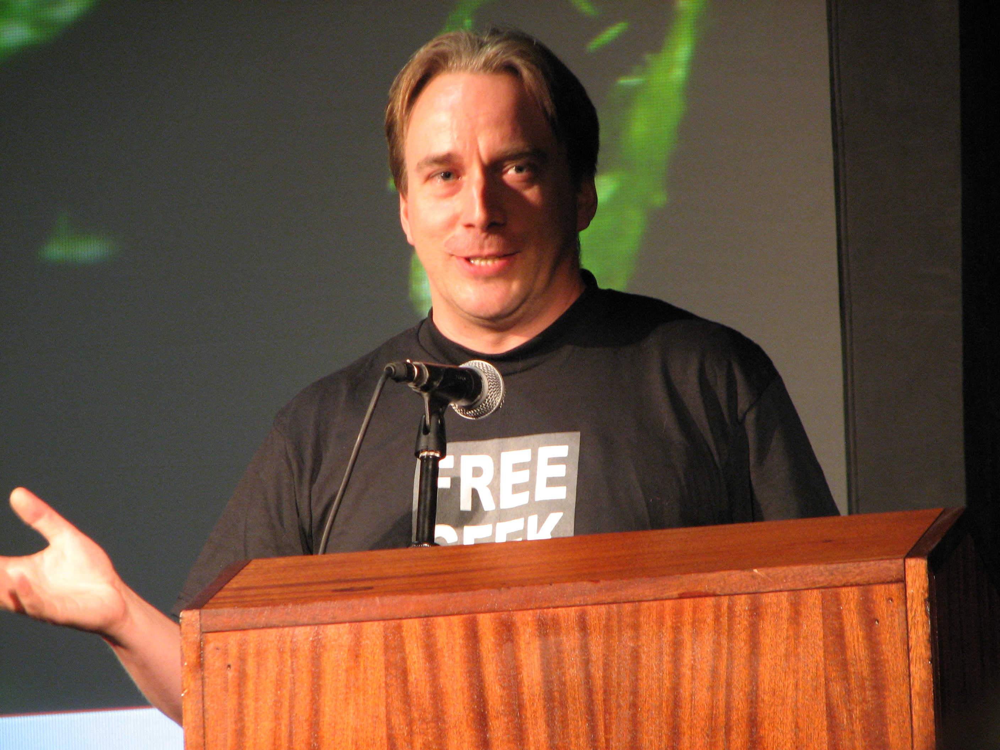

==  Les distributions Linux

Dans le langage courant, on parle de "Linux" pour désigner le système d'exploitation complet.
Techniquement, Linux est uniquement le noyau (ou kernel en anglais) développé par le finlandais Linus Torvalds en 1991.

//https://flic.kr/p/72vuYo
.Linus Torvald, créateur du noyau Linux

Le kernel est la pièce fondamentale de tout système d'exploitation : Windows, Mac OS, Linux, *BSD...
Il gère la communication entre les logiciels et le matériel, la planification des processus (les programmes qui sont lancés), et bien entendu, il initialise et pilote le matériel.
Le cœur du kernel Linux sur les distributions courantes (sans les modules) fait environ 4 Mo.
Un kernel seul, bien qu'il soit la pièce maîtresse, ne fait pas l'entièreté d'un système d'exploitation.
Il y a beaucoup d'autres logiciels nécessaires.
Par exemple, toutes les commandes de base (cd, ls, cat et autres) sont chacune des mini-logiciels.
Toutes ces commandes de bases font parties d'un autre projet open-source, appellé GNU
footnote:[http://fr.wikipedia.org/wiki/GNU] (GNU is Not Unix).
Puis il y a encore l'environnement de bureau (l'interface graphique).
Il y en a plusieurs disponibles pour Linux.

.Interfaces graphiques les plus connues
[cols="1,4"]
|===
|Nom |Description

|Unity
|l'interface d'Ubuntu, basé sur Gnome

|Gnome
|reprend quelques idées de Mac OS, c'est à dire une interface simple et épurée

|KDE
|reprend quelques idées de Windows, notamment le menu démarrer, la liste des programmes. Son but n'est pas d'être simple ou épuré, mais de proposer le plus de fonctionnalités possibles

|Cinnamon
|un dérivé de Gnome créé par la distribution Linux Mint

|XFCE
|un bureau minimaliste ressemblant à Gnome, mais moins gourmand en CPU et mémoire, permettant ainsi de le faire tourner sur des machines plus modestes

|LXDE
|encore plus léger que xfce, l'interface semble aujourd'hui un peu obsolète par rapport à ce qu'on connaît, mais il tourne sur de très vieilles configurations
|===

Il y a encore beaucoup d'autres logiciels nécessaires comme la gestion du démarrage des services, le login screen , l'assistant d'installation, et.
Une distribution est donc un package constitué de ces nombreux logiciels qui, ensemble, forment un système d'exploitation complet utilisable par vous et mo.
Chaque distribution fait des choix dans les programmes employés pour remplir les divers besoin.
Ces choix sont basés sur des objectifs et une philosophie différent.
Les distributions peuvent également être regroupées en familles car certaines distributions sont dérivées d'autre.

.Liste des distributions Linux les plus courantes.
[graphviz, "figures/distributions", svg]
----
digraph paths {
    graph [overlap = false];
    Debian               -> Ubuntu
    Debian               -> SteamOS
    Ubuntu               -> "Linux Mint"
    "Red Hat Enterprise" -> Fedora
    "Red Hat Enterprise" -> Centos
    "SUSE Enterprise"    -> OpenSUSE
    Archlinux
    Slackware
    Gentoo
}
----

.Description des principales distributions
[cols="1,1,1,4"]
|===
|Nom |Parenté |Bureau par défaut |Description

|Debian
|-
|Gnome
|Distribution entièrement gérée par une communauté de bénévoles qui a vu le jour en 1996. Elle a créé le système de paquet apt-get et beaucoup de distributions actuelles sont basés dessus.

|Ubuntu
|Debian
|Unity
|Probablement la plus connue des distributions. Créée par Marc Shuttleworth, un sud-africain, cette distribution a pour but d'être la plus facile d'accès et de masquer au maximum la complexité technique. Elle est basée sur Debian.

|Linux Mint
|Ubuntu
|Cinnamon
|Basé sur Ubuntu, Linux Mint est une distribution récente qui pense pouvoir faire mieux qu'Ubuntu. Ils ont donc fait d'autres choix. Ils ont notamment ré-écris l'environnement de bureau pour donner naissance à Cinnamon.

|StemOS
|Debian
|Gnome
|Basé sur Debian, cette distribution a été créée en 2013 par Valve Software dans le but de créer une console de jeux basée sur Steam.

|Red Hat Enterprise Linux
|Fedora
|Gnome
|Red Hat est la société américaine bien connue pour sa distribution Linux orientée entreprise. Le contrat oblige l'utilisateur a payer la licence dès qu'une Red Hat est installé, et bénéficie ainsi du support. On ne peut pas installer une Red Hat sans payer. Cette distribution vise la stabilité avant tout, afin de faire tourner des serveurs. Elle n'a donc pas toujours toutes les dernières nouveautés.

|Centos
|Red Hat Enterprise Linux
|Gnome
|Centos est un projet maintenu par des bénévoles, qui reprennent le code source de Red Hat, et le re-package. Une Centos est donc un Red Hat « re-brandé », et entièrement gratuit.

|Fedora
|Red Hat Enterprise Linux
|Gnome
|Fedora est la distribution « laboratoire » de Red Hat. Elle est mise à jour tous les 6 mois avec les dernières versions de tous les logiciels. Les meilleurs logiciels dans leur meilleure version sont retenu pour la création des Red Hat Linux.

|Archlinux
|-
|-
|C'est une distribution qui suit le principe KISS footnote:[Keep It Simple, Stupid : http://fr.wikipedia.org/wiki/Principe_KISS], et est à conseiller pour toute personne curieuse qui veut en connaître plus sur le fonctionnement interne de Linux. En effet, après l'installation, on se retrouver avec un linux en command-line minimal. Tout le reste doit être installé et configuré à la main. La documentation sur leur site web est exemplaire.

|Slackware
|-
|KDE
|Slackware fait figure de dinosaure car elle a été la première distribution réalisée à grande échelle, en 1992 (le kernel Linux date de 1991). Elle est toujours maintenue par une seule personne : Patrick Volkerding. C'est une distribution extrêmement dépouillée et simple.

|OpenSUSE
|-
|Gnome
|Distribution gérée par une communauté ainsi que des employé de la société allemande SUSE. Elle vise la facilité d'administration via des outils comme yast, un menu global permettant de configurer l'entièreté du système. Elle est donc plus accessible pour des gens qui seraient moins experts en Linux. Le danger étant bien entendu de ne pas comprendre ce qui se passe réellement derrière, et donc une difficulté de troubleshooting.

|Suse Enterprise
|OPenSUSE
|Gnome
|Version entreprise et payante d'OpenSUSE.

|Gentoo
|-
|KDE
|Le concept de Gentoo est que toute application est compilée avant installation alors que toutes autres distributions téléchargent une version pré-compilée. Selon la puissance de votre machine et la grosseur du logiciel, la compilation peut prendre plus ou moins de temps. L'idée c'est qu'en compilant sur votre machine, on pourra exploiter toutes les instructions spécifiques du CPU alors que lorsque c'est pré-compilé, on doit utiliser un set d'instructions standard afin que cela fonctionne sur toutes les machines. C'est donc un léger gain de performance. Mais cela n'a vraiment de sens que pour des supercalculateurs, ou au contraire, des vieilles machines pour lesquels tout gain de performance est intéressant.
|===

Vous trouverez une liste de toutes les distributions connues sur le site distrowatch footnote:[http://distrowatch.com/].